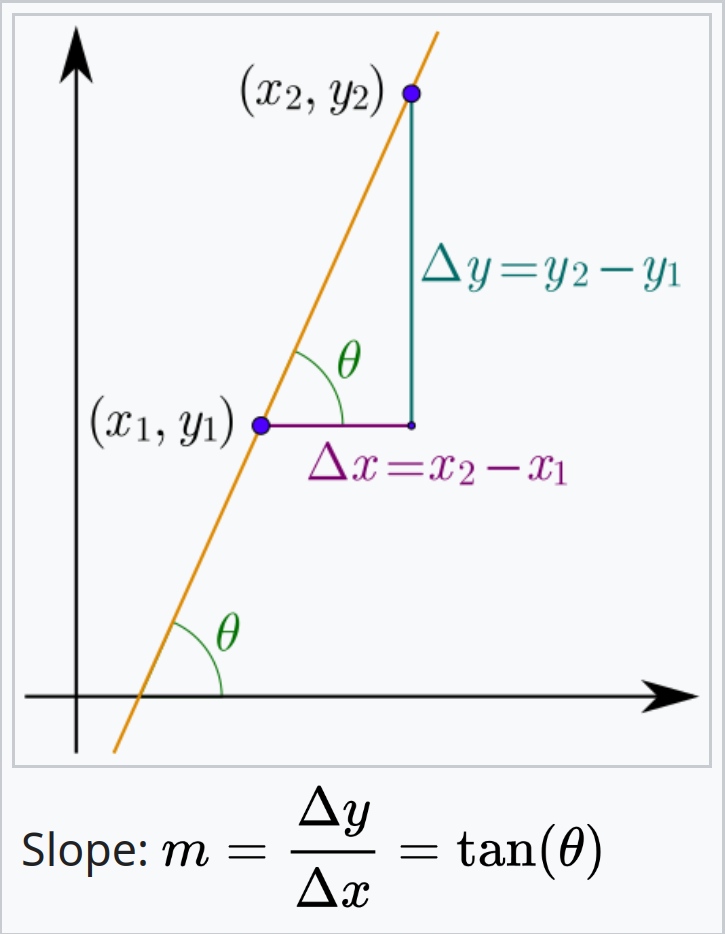
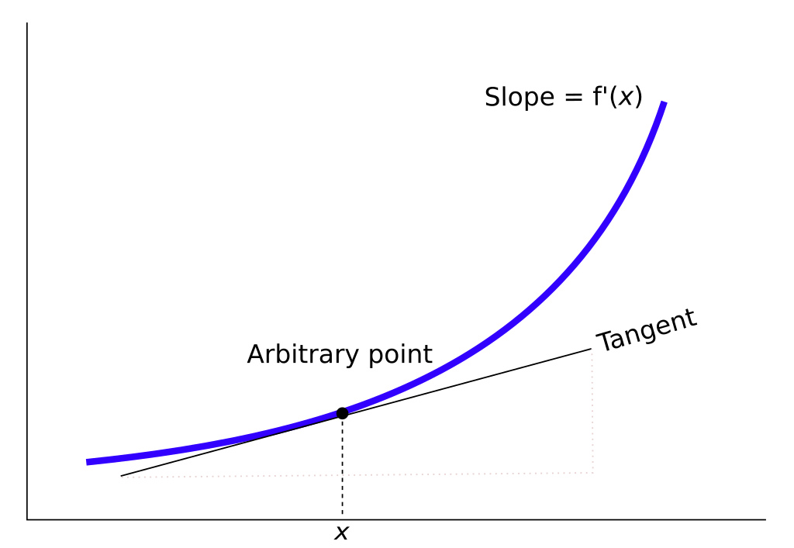
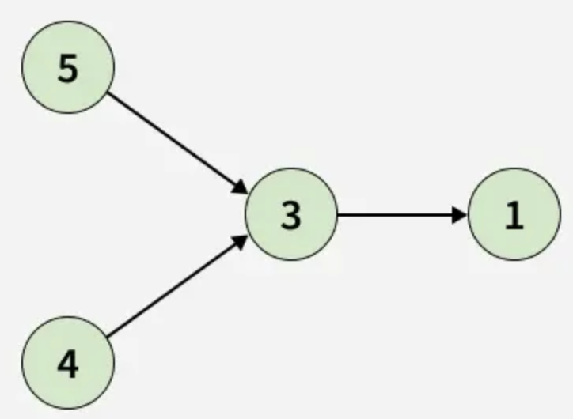
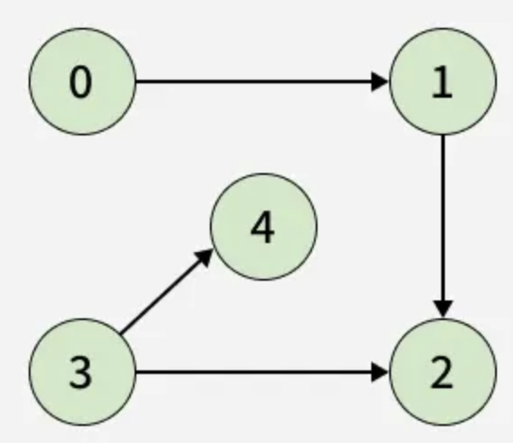
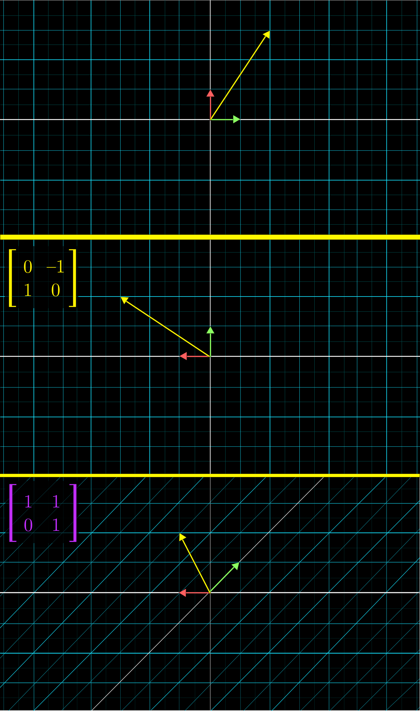
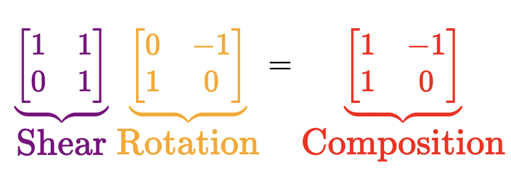
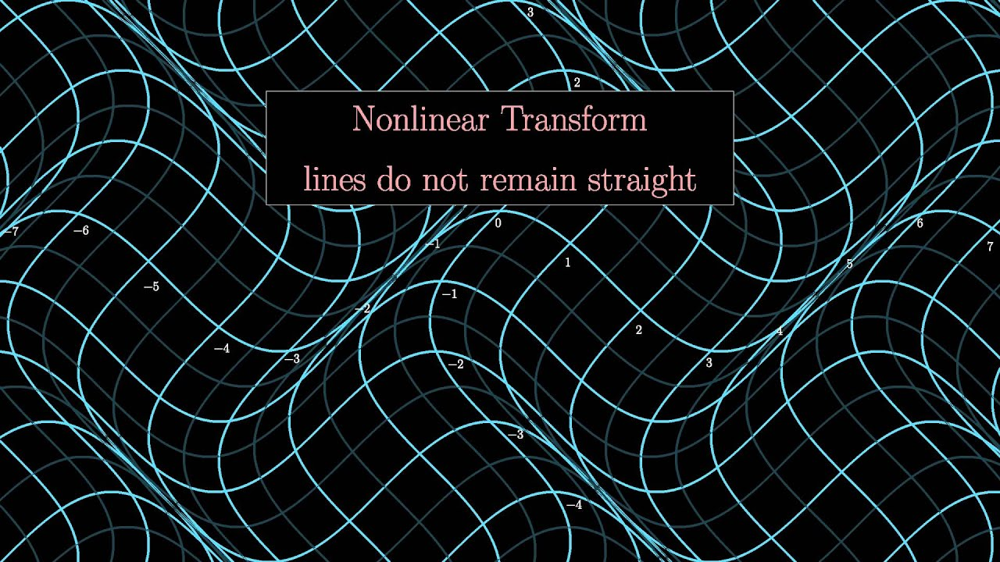
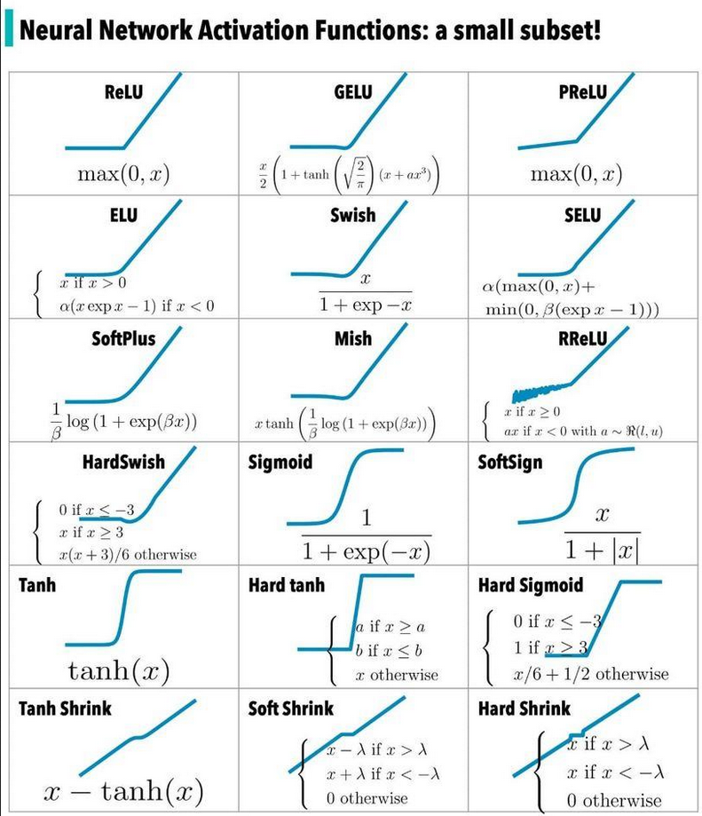
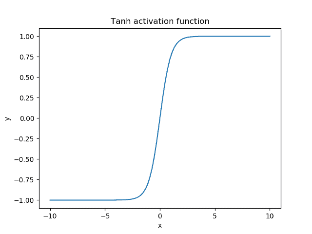
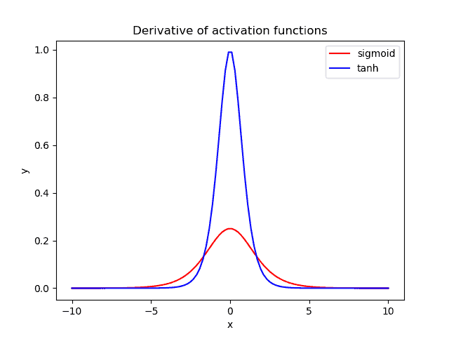

# Table of contents

- [Table of contents](#table-of-contents)
- [Week 01 - Hello, Deep Learning. Implementing a Multilayer Perceptron](#week-01---hello-deep-learning-implementing-a-multilayer-perceptron)
  - [Administrative](#administrative)
  - [What is deep learning?](#what-is-deep-learning)
  - [Modeling a neuron that can multiply by 2](#modeling-a-neuron-that-can-multiply-by-2)
  - [Python Packages](#python-packages)
    - [What are packages in Python?](#what-are-packages-in-python)
    - [Importing means executing the script](#importing-means-executing-the-script)
  - [NumPy](#numpy)
    - [0. Importing](#0-importing)
    - [1. Array Creation](#1-array-creation)
    - [2. Array Attributes and Inspection](#2-array-attributes-and-inspection)
    - [3. Array Manipulation](#3-array-manipulation)
    - [4. Indexing, Slicing, and Iteration](#4-indexing-slicing-and-iteration)
    - [5. Mathematical and Universal Functions (`ufuncs`)](#5-mathematical-and-universal-functions-ufuncs)
    - [6. Linear Algebra](#6-linear-algebra)
    - [7. Statistical Functions](#7-statistical-functions)
    - [8. Broadcasting](#8-broadcasting)
    - [9. Random Number Generation](#9-random-number-generation)
    - [10. File I/O and Miscellaneous](#10-file-io-and-miscellaneous)
  - [Matplotlib](#matplotlib)
    - [Line plot](#line-plot)
    - [Scatter plot](#scatter-plot)
    - [Drawing multiple plots on one figure](#drawing-multiple-plots-on-one-figure)
    - [The logarithmic scale](#the-logarithmic-scale)
    - [Histogram](#histogram)
      - [Introduction](#introduction)
      - [In `matplotlib`](#in-matplotlib)
      - [Use cases](#use-cases)
    - [Checkpoint](#checkpoint)
    - [Customization](#customization)
      - [Axis labels](#axis-labels)
      - [Title](#title)
      - [Ticks](#ticks)
      - [Adding more data](#adding-more-data)
      - [`plt.tight_layout()`](#plttight_layout)
        - [Problem](#problem)
        - [Solution](#solution)
  - [Random numbers](#random-numbers)
    - [Context](#context)
    - [Random generators](#random-generators)
  - [Code formatting](#code-formatting)
  - [Behavior-driven development](#behavior-driven-development)
- [Week 02 - Implementing Gradient Descent](#week-02---implementing-gradient-descent)
  - [Backpropagation](#backpropagation)
  - [Topological sort](#topological-sort)
  - [Activation functions](#activation-functions)
  - [Python OOP (Magic Methods)](#python-oop-magic-methods)
    - [Initialization and Construction](#initialization-and-construction)
    - [Arithmetic operators](#arithmetic-operators)
    - [String Magic Methods](#string-magic-methods)
    - [Comparison magic methods](#comparison-magic-methods)
  - [Introducing `dl_lib`](#introducing-dl_lib)

# Week 01 - Hello, Deep Learning. Implementing a Multilayer Perceptron

## Administrative

- [ ] Create a chat in Messenger:
  - name: `DL_25-26`;
  - a place where we can chat and reach each other faster;
  - everybody who participates in the course, can be there;
  - I'll try to check it once per week;
  - if I don't answer, please drop me an email to go and check the chat.

## What is deep learning?

What is your experience with deep learning? Who has built a deep learning model? What was it about?

<details>

<summary>What is machine learning?</summary>

A process for **automatic pattern recognition**.

</details>

<details>

<summary>What is feature engineering?</summary>

The process of manually creating new features (presumably more informative than the available ones) using already available features.

</details>

<details>

<summary>Does machine learning automatically do feature engineering?</summary>

No. Usually the data scientist is responsible for giving the models the best features.

</details>

<details>

<summary>What is deep learning?</summary>

A process that performs **automatic feature engineering** and **automatic pattern recognition**.

</details>

<details>

<summary>The two main branches of programming are "imperative" and "functional". How are tasks solved in these paradigms?</summary>

You write the code directly; you tell the machine what it has to do **explicitly** and you write exactly the code solves the task by outlining and connecting multiple steps together (i.e. you create an algorithm).

</details>

<details>

<summary>How are tasks solved in the paradigm of deep learning?</summary>

You build a deep learning model that models the task you are tying to solve and the model itself creates the algorithm for solving your task.

</details>

<details>

<summary>What is a deep learning model?</summary>

Set of parameters connected in various ways.

</details>

<details>

<summary>Hmm - so, how can a set of parameters solve a task?</summary>

By assigning the optimal value to each of these parameters.

</details>

<details>

<summary>But what is an optimal value?</summary>

The value with which the model can *in most cases* solve a task.

Notice then that a deep learning model is an automatic mathematical optimization model for a set of parameters. **`It solves tasks by approximation, not by building explicit logic`**.

</details>

<details>

<summary>How is the process of parameter optimization called?</summary>

Training.

</details>

<details>

<summary>What is the first step in any processing task?</summary>

The description of the desired model behavior is codified into input-output pairs.

This description of the expected behavior is **implicitly** hidden in the data in the form of **patterns**. Thus, deep learning is uncovering those patterns and using them to solve various problems.

</details>

<details>

<summary>What steps happen during training?</summary>

1. You give the untrained model your data (your `description` of desired behavior).
2. The model returns an answer.
3. You calculate how far the model is from your ground truth answer.
4. The model uses this information to tweak its parameters until it fits your description well enough.

</details>

And there you have it - a deep learning model that does what you want! Right?

<details>

<summary>When does a model become perfect?</summary>

It can never be perfect. Because it solves the task by approximation it'll always be solving the task by simulating proficiency.

</details>

<details>

<summary>What does it mean for a model to tweak its parameters?</summary>

It's a process whereby:

1. Multiple models are created each with slightly different values for their parameters.
2. Their distance to the ground truth labels is measured.
3. The model that is closest to the ground truth labels is taken to be the final model.

</details>

<details>

<summary>What tasks can deep learning models solve?</summary>

Here is the twist - they can solve `everything`! For any task as long as you have enough data, you can model it.

</details>

One of the things you can model is **the probability of the next word in a sentence**.

<details>

<summary>What class of models solve this task?</summary>

Large Language Models!

You have a partially written sentence and you can create a mathematical model that predicts how likely every possible word, in the language you're working in, is to be the next word in that sentence. And after you've selected the word, you can repeat the process on this extended sentence - that's how you get `ChatGPT`.

</details>

<details>

<summary>What are the typical job roles related to AI and how do they work together?</summary>

- Data Engineer: responsible for finding/producing/curating and labelling data.
- Data Scientist: responsible for training the best model possible, given the available data.
- Machine Learning Engineer: responsible for taking a trained model and wrapping it in a production system used by clients.


Lately, different types of combinations of these roles have popped up:

- Machine Learning Scientist: responsible for building, training and deploying a model.
- AI Engineer: responsible for using pre-trained models and already existing tools to build user-facing applications.

</details>

## Modeling a neuron that can multiply by 2


We want to teach the model that $w$ has to equal $2$.

<details>

<summary>How would we go about doing this?</summary>

1. We start with a random guess for $w$. For the sake of concreteness, let's say a random floating-point number in the interval `[0, 10)`. The interval does not matter  - even if it does not contain $2$ the traning process would converge towards it.


2. We calculate the value of the loss function at that initial random guess.


3. We can see what will happen if we "wiggle" $w$ by a tiny amount `eps`.


4. So, the value either goes up or down. This means that our loss function would represent a parabola.


5. If only we had a way to always know in which direction the value would go down? Oh, wait - we do! It's the opposite direction of the one in which the derivative grows!


For now, we won't calculate the exact derivative because we don't need to do that - we can use its general formula:

$${\displaystyle L=\lim _{eps\to 0}{\frac {loss(w+eps)-loss(w)}{eps}}}$$

6. We can then use `L` to step in the direction of decline, by doing: `w -= L`.

7. This, however, will have a problem: the value of `L` might be very high. If our step is always `L` we would start oscilating. Therefore, we'll use a learning rate that will say how large our step would be: `w -= learning_rate * L`.

And this is it! This process is guaranteed to find $2$ as the optimal value. Moreover, this iterative algorithm for minimizing a differentiable multivariate function is what is also known as [Gradient Descent](https://en.wikipedia.org/wiki/Gradient_descent) 😇.

</details>

<details>

<summary>What would the architecture and process for creating a model of an "AND" logical gate look like?</summary>

We might start off with something like this:


However, because our task now shifts from being a regression one into a classification one, we can also add the `sigmoid` function to control the output values:

$${\displaystyle f(x)={\frac {1}{1+e^{-x}}}}$$


<details>

<summary>But! Adding the sigmoid activation function actually causes another problem - what input values would produce a problem?</summary>

Look at what happens when we have $x_1=0$ and $x_2=0$ - the model will return $0$ as an output which will be transformed into $0.5$ by the sigmoid and if we're using $>= 0.5$ as a threshold, we'd return $1$:


</details>

<details>

<summary>How do we fix this?</summary>

Welcome, ***bias***! It'll handle the logic the neuron would apply when the linear combination adds up to $0$, be it due to the weights being $0$ or the inputs.


</details>

</details>

<details>

<summary>How do we model the "XOR" logical gate?</summary>

Let's see how the classes are distributed in `2D` space:


The models we defined above are actually called perceptrons. They calculate a weighted sum of their inputs and thresholds it with a step function.

Geometrically, this means **the perceptron can separate its input space with a hyperplane**. That’s where the notion that a perceptron can only separate linearly separable problems comes from.

Since the `XOR` function **is not linearly separable**, it really is impossible for a single hyperplane to separate it.

<details>

<summary>What are our next steps then?</summary>

We need to describe the `XOR` gate using non-`XOR` gates. This can be done:

`(x|y) & ~(x&y)`

So, the `XOR` model can then be represented using the following architecture:


<details>

<summary>How many parameters would we have in total?</summary>

9

</details>

</details>

</details>

## Python Packages

### What are packages in Python?

You write all of your code to one and the same Python script.

<details>

<summary>What are the problems that arise from that?</summary>

- Huge code base: messy;
- Lots of code you won't use;
- Maintenance problems.

</details>

<details>

<summary>How do we solve this problem?</summary>

We can split our code into libraries (or in the Python world - **packages**).

Packages are a directory of Python scripts.

Each such script is a so-called **module**.

Here's the hierarchy visualized:


These modules specify functions, methods and new Python types aimed at solving particular problems. There are thousands of Python packages available from the Internet. Among them are packages for data science:

- there's **NumPy to efficiently work with arrays**;
- **Matplotlib for data visualization**;
- **scikit-learn for machine learning**.

</details>

Not all of them are available in Python by default, though. To use Python packages, you'll first have to install them on your own system, and then put code in your script to tell Python that you want to use these packages. Advice:

- always install packages in **virtual environments** (abstractions that hold packages for separate projects).
  - You can create a virtual environment by using the following code:

    ```console
    python3 -m venv .venv
    ```

    This will create a hidden folder, called `.venv`, that will store all packages you install for your current project (instead of installing them globally on your system).

  - If there is a `requirements.txt` file, use it to install the needed packages beforehand.
    - In the github repo, there is such a file - you can use it to install all the packages you'll need in the course. This can be done by using this command:

    ```console
    (if on Windows) > .venv\Scripts\activate
    (if on Linux/Mac) > source .venv/bin/activate
    (.venv) > pip install -r requirements.txt
    ```

Now that the package is installed, you can actually start using it in one of your Python scripts. To do this you should import the package, or a specific module of the package.

You can do this with the `import` statement. To import the entire `numpy` package, you can do `import numpy`. A commonly used function in NumPy is `array`. It takes a Python list as input and returns a [`NumPy array`](https://numpy.org/doc/stable/reference/generated/numpy.array.html) object as an output. The NumPy array is very useful to do data science, but more on that later. Calling the `array` function like this, though, will generate an error:

```python
import numpy
array([1, 2, 3])
```

```console
NameError: name `array` is not defined
```

To refer to the `array` function from the `numpy` package, you'll need this:

```python
import numpy
numpy.array([1, 2, 3])
```

```console
array([1, 2, 3])
```

This time it works.

Using this `numpy.` prefix all the time can become pretty tiring, so you can also import the package and refer to it with a different name. You can do this by extending your `import` statement with `as`:

```python
import numpy as np
np.array([1, 2, 3])
```

```console
array([1, 2, 3])
```

Now, instead of `numpy.array`, you'll have to use `np.array` to use NumPy's functions.

There are cases in which you only need one specific function of a package. Python allows you to make this explicit in your code.

Suppose that we ***only*** want to use the `array` function from the NumPy package. Instead of doing `import numpy`, you can instead do `from numpy import array`:

```python
from numpy import array
array([1, 2, 3])
```

```console
array([1, 2, 3])
```

This time, you can simply call the `array` function without `numpy.`.

This `from import` version to use specific parts of a package can be useful to limit the amount of coding, but you're also loosing some of the context. Suppose you're working in a long Python script. You import the array function from numpy at the very top, and way later, you actually use this array function. Somebody else who's reading your code might have forgotten that this array function is a specific NumPy function; it's not clear from the function call.


^ using numpy, but not very clear

Thus, the more standard `import numpy as np` call is preferred: In this case, your function call is `np.array`, making it very clear that you're working with NumPy.


- Suppose you want to use the function `inv()`, which is in the `linalg` subpackage of the `scipy` package. You want to be able to use this function as follows:

    ```python
    my_inv([[1,2], [3,4]])
    ```

    Which import statement will you need in order to run the above code without an error?

  - A. `import scipy`
  - B. `import scipy.linalg`
  - C. `from scipy.linalg import my_inv`
  - D. `from scipy.linalg import inv as my_inv`

    <details>

    <summary>Reveal answer:</summary>

    Answer: D

    </details>

### Importing means executing the script

Remember that importing a package is equivalent to executing it. Thus, you should always have `if __name__ == '__main__'` block of code and call your functions from there.

Run the scripts `test_script1.py` and `test_script2.py` that are in the current week's folder to see the differences.

## NumPy

NumPy is a fundamental Python library for numerical computing, providing support for large, multi-dimensional arrays and matrices, along with a collection of mathematical functions to operate on these arrays efficiently.

### 0. Importing

By convention `numpy` is imported with the alias `np`:

```python
import numpy as np
```

### 1. Array Creation

These functions create new arrays from scratch or from existing data.

Use the official documentation of NumPy: <https://numpy.org/doc/stable/reference/arrays.ndarray.html#the-n-dimensional-array-ndarray>, to fill in the missing parts (marked with `???`) below.

| Function | Problem Solved | Example |
|----------|----------------|---------|
| `np.array(object, dtype=None)` | Converts lists, tuples, or other iterables into NumPy arrays. | `np.array([[1, 2], [3, 4]])`  # Creates a 2x2 array |
| `np.zeros(shape, dtype=float)` | Creates arrays filled with zeros. | `???`  # 2x3 array of zeros |
| `np.ones(shape, dtype=None)` | ??? | `???`  # 3x2 array of integer ones |
| `np.full(shape, fill_value, dtype=None)` | ??? | `np.full((2, 2), 5)`  # ??? |
| `np.eye(N, M=None, k=0, dtype=float)` | ??? | `???`  # a matrix with 1 on the upper-right diagonal |
| `np.identity(n, dtype=None)` | ??? | `np.identity(4)`  # ??? |
| `np.arange(start=0, stop, step=1, dtype=None)` | Generates evenly spaced values within a range, like Python's `range`. | `???`  # array([0, 2, 4, 6, 8]) |
| `np.linspace(start, stop, num=50, endpoint=True)` | Creates evenly spaced samples over an interval. | `???`  # array([0., 0.25, 0.5, 0.75, 1.]) |
| `np.logspace(start, stop, num=50, base=10.0)` | Generates logarithmically spaced numbers, for exponential scales. | `np.logspace(0, 2, 3)`  # ??? |

<details>
<summary>Reveal answer</summary>

| Function | Problem Solved | Example |
|----------|----------------|---------|
| `np.array(object, dtype=None)` | Converts lists, tuples, or other iterables into NumPy arrays. | `np.array([[1, 2], [3, 4]])`  # Creates a 2x2 array |
| `np.zeros(shape, dtype=float)` | Creates arrays filled with zeros. | `np.zeros((2, 3))`  # 2x3 array of zeros |
| `np.ones(shape, dtype=None)` | Creates arrays filled with ones. | `np.ones((3, 2), dtype=int)`  # 3x2 array of integer ones |
| `np.full(shape, fill_value, dtype=None)` | Fills arrays with a specified value. | `np.full((2, 2), 5)`  # 2x2 array filled with 5 |
| `np.eye(N, M=None, k=0, dtype=float)` | Return a 2-D array with ones on a diagonal and zeros elsewhere. | `np.eye(3, k=1)`  # a matrix with 1 on the upper-right diagonal |
| `np.identity(n, dtype=None)` | Similar to `eye` but always square with `1` on the main diagonal. | `np.identity(4)`  # 4x4 identity matrix |
| `np.arange(start=0, stop, step=1, dtype=None)` | Generates evenly spaced values within a range, like Python's `range`. | `np.arange(0, 10, 2)`  # array([0, 2, 4, 6, 8]) |
| `np.linspace(start, stop, num=50, endpoint=True)` | Creates evenly spaced samples over an interval. | `np.linspace(0, 1, 5)`  # array([0., 0.25, 0.5, 0.75, 1.]) |
| `np.logspace(start, stop, num=50, base=10.0)` | Generates logarithmically spaced numbers, for exponential scales. | `np.logspace(0, 2, 3)`  # array([1., 10., 100.]) |

</details>

### 2. Array Attributes and Inspection

These attributes provide metadata about arrays.

Use the official documentation of NumPy: <https://numpy.org/doc/stable/reference/arrays.ndarray.html#the-n-dimensional-array-ndarray>, to fill in the missing parts (marked with `???`) below.

```python
arr = np.array([[1, 2, 3]])
```

| Attribute | Problem Solved | Example |
|--------------------|----------------|---------|
| `.shape` | ??? | `arr.shape`  # ??? |
| `.ndim` | ??? | `arr.ndim`  # ??? |
| `.size` | ??? | `arr.size`  # ??? |
| `.dtype` | ??? | `arr.dtype`  # ??? |

<details>
<summary>Reveal answer</summary>

| Attribute | Problem Solved | Example |
|--------------------|----------------|---------|
| `.shape` | Returns the dimensions of the array. | `arr.shape`  # (1, 3) |
| `.ndim` | Gives the number of dimensions. | `arr.ndim`  # 2 (since the array is a matrix: 1 row, 3 columns) |
| `.size` | Total number of elements. | `arr.size`  # 3 |
| `.dtype` | Data type of elements. | `arr.dtype`  # dtype('int64') |

</details>

### 3. Array Manipulation

These functions reshape, combine, or split arrays, addressing data restructuring needs.

Use the official documentation of NumPy: <https://numpy.org/doc/stable/reference/arrays.ndarray.html#the-n-dimensional-array-ndarray>, to fill in the missing parts (marked with `???`) below.

```python
arr = np.arange(6)
```

| Function | Problem Solved | Example |
|----------|----------------|---------|
| `arr.reshape(newshape)` | Changes array shape **without copying** data. | `reshaped = arr.reshape(2, 3); reshaped`  # ??? |
| `arr.ravel(order='C')` | ??? | `reshaped.ravel()`  # ??? |
| `arr.flatten(order='C')` | ??? | `reshaped.flatten()`  # array([0,1,2,3,4,5]) |
| `arr.T` or `arr.transpose(*axes)` | ??? | `reshaped.T`  # ??? |
| `np.concatenate((a1, a2, ...), axis=0)` | ??? | `np.concatenate((np.ones(2), np.zeros(2)))`  # ??? |
| `np.vstack(tup)` | ??? | `???`  # 2x3 array |
| `np.hstack(tup)` | ??? | `???`  # 2x2 array |
| `np.split(ary, indices_or_sections, axis=0)` | ??? | `???`  # [array([0,1]), array([2,3]), array([4,5])] |
| `np.repeat(a, repeats, axis=None)` | ??? | `np.repeat([1,2], 2)`  # array([1,1,2,2]) |
| `np.pad(array, pad_width, mode='constant')` | ??? | `np.pad(np.ones((2,2)), 1)`  # ??? |
| `np.diag(v, k=0)` | ??? | `np.diag(np.array([[1,2],[3,4]]))`  # ??? <br> `np.diag([1,2,3])`  # ??? |

<details>
<summary>Reveal answer</summary>

| Function | Problem Solved | Example |
|----------|----------------|---------|
| `arr.reshape(newshape)` | Changes array shape **without copying** data. | `reshaped = arr.reshape(2, 3); reshaped`  # `[[0,1,2],[3,4,5]]` |
| `arr.ravel(order='C')` | Flattens multi-dimensional array into 1D. A copy is made only if needed. | `reshaped.ravel()`  # array([0,1,2,3,4,5]) |
| `arr.flatten(order='C')` | Similar to `ravel` but always copies. | `reshaped.flatten()`  # array([0,1,2,3,4,5]) |
| `arr.T` or `arr.transpose(*axes)` | Swaps axes, essential for matrix operations like dot products. | `reshaped.T`  # `[[0,3],[1,4],[2,5]]` |
| `np.concatenate((a1, a2, ...), axis=0)` | Joins arrays along an axis, for merging datasets. | `np.concatenate((np.ones(2), np.zeros(2)))`  # array([1.,1.,0.,0.]) |
| `np.vstack(tup)` | Stacks arrays vertically (row-wise), for building matrices from rows. | `np.vstack((np.arange(3), np.arange(3)))`  # 2x3 array |
| `np.hstack(tup)` | Stacks horizontally (column-wise), for adding columns. | `np.hstack((np.ones((2,1)), np.zeros((2,1))))`  # 2x2 array |
| `np.split(ary, indices_or_sections, axis=0)` | Splits array into sub-arrays, for partitioning data. | `np.split(np.arange(6), 3)`  # [array([0,1]), array([2,3]), array([4,5])] |
| `np.repeat(a, repeats, axis=None)` | Repeats elements for upsampling. | `np.repeat([1,2], 2)`  # array([1,1,2,2]) |
| `np.pad(array, pad_width, mode='constant')` | Adds padding to arrays. | `np.pad(np.ones((2,2)), 1)`  # 4x4 with zeros around |
| `np.diag(v, k=0)` | Extracts diagonal or constructs a diagonal matrix. | `np.diag(np.array([[1,2],[3,4]]))`  # array([1,4]) <br> `np.diag([1,2,3])`  # 3x3 matrix with [1,2,3] on the main diagonal |

</details>

### 4. Indexing, Slicing, and Iteration

These allow accessing and modifying subsets, solving efficient data extraction problems.

Use the official documentation of NumPy: <https://numpy.org/doc/stable/reference/arrays.ndarray.html#the-n-dimensional-array-ndarray>, to fill in the missing parts (marked with `???`) below.

```python
arr = np.arange(10)
```

| Function | Problem Solved | Example |
|----------|----------------|---------|
| `arr[start:stop:step]` | Extracts sub-arrays, like list slicing but multi-dimensional. | `arr[2:7:2]`  # ??? |
| `arr[[indices]]` | Selects specific elements by index lists, for non-contiguous access. | `???`  # array([0,3,5]) |
| `arr[condition]` | Filters based on conditions. | `arr[arr > 5]`  # ??? <br> `???` # array([6, 8])|
| `np.where(condition, x, y)` | ??? | `np.where(arr > 5, arr, 0)`  # ??? |
| `np.argwhere(a)` | ??? | `np.argwhere(arr > 5)`  # ??? |

<details>
<summary>Reveal answer</summary>

| Function | Problem Solved | Example |
|----------|----------------|---------|
| `arr[start:stop:step]` | Extracts sub-arrays, like list slicing but multi-dimensional. | `arr[2:7:2]`  # array([2,4,6]) |
| `arr[[indices]]` | Selects specific elements by index lists, for non-contiguous access. | `arr[[0,3,5]]`  # array([0,3,5]) |
| `arr[condition]` | Filters based on conditions. | `arr[arr > 5]`  # array([6,7,8,9]) <br> `arr[(arr > 5) & (arr % 2 == 0)]` # array([6, 8])|
| `np.where(condition, x, y)` | Conditional element-wise selection, like ternary operators for arrays. | `np.where(arr > 5, arr, 0)`  # array([0, 0, 0, 0, 0, 0, 6, 7, 8, 9]) |
| `np.argwhere(a)` | Finds indices of non-zero elements, for locating matches. | `np.argwhere(arr > 5)`  # `array([[6],[7],[8],[9]])` |

</details>

### 5. Mathematical and Universal Functions (`ufuncs`)

Element-wise operations on arrays, solving **vectorized computations** for speed over loops.

Use the official documentation of NumPy: <https://numpy.org/doc/stable/reference/arrays.ndarray.html#the-n-dimensional-array-ndarray>, to fill in the missing parts (marked with `???`) below.

| Function | Problem Solved | Example |
|----------|----------------|---------|
| `x1 + x2` or `np.add(x1, x2)` | ??? | `np.add(np.ones(3), np.arange(3))`  # ??? |
| `-` or `np.subtract(x1, x2)` | ??? | `np.subtract(np.arange(3), 1)`  # ??? |
| `*` or `np.multiply(x1, x2)` | ??? | `np.multiply(2, np.arange(3))`  # ??? |
| `/` or `np.divide(x1, x2)` | ??? | `np.divide(np.arange(1,4), 2)`  # ??? |
| `**` or `np.power(x1, x2)` | ??? | `np.power(2, np.arange(3))`  # ??? |
| `np.sqrt(x)` | ??? | `np.sqrt(np.array([4,9,16]))`  # ??? |
| `np.exp(x)` | ??? | `np.exp(np.array([0,1]))`  # ??? |
| `np.log(x)` | ??? | `np.log(np.exp(144))`  # ??? |
| `np.sin(x)`, `np.cos(x)`, `np.tan(x)` | Trigonometric functions or angles. | `np.sin(np.pi/2)`  # ??? |
| `np.abs(x)` | Absolute value. | `np.abs(np.array([-1,0,1]))`  # ??? |
| `np.round(a, decimals=0)` | Rounding or precision control. | `np.round(3.14159, 2)`  # ??? |
| `np.clip(a, a_min, a_max)` | Limits values to a range. | `np.clip(np.arange(5), 1, 3)`  # ??? |
| `np.cumsum(a, axis=None)` | Cumulative sum totals. | `???`  # array([0,1,3,6]) |
| `np.diff(a, n=1, axis=-1)` | ??? | `???`  # array([3,5]) |

<details>
<summary>Reveal answer</summary>

| Function | Problem Solved | Example |
|----------|----------------|---------|
| `x1 + x2` or `np.add(x1, x2)` | Element-wise addition. | `np.add(np.ones(3), np.arange(3))`  # array([1,2,3]) |
| `-` or `np.subtract(x1, x2)` | Element-wise subtraction. | `np.subtract(np.arange(3), 1)`  # array([-1,0,1]) |
| `*` or `np.multiply(x1, x2)` | Element-wise multiplication. | `np.multiply(2, np.arange(3))`  # array([0,2,4]) |
| `/` or `np.divide(x1, x2)` | Element-wise division. | `np.divide(np.arange(1,4), 2)`  # array([0.5,1.,1.5]) |
| `**` or `np.power(x1, x2)` | Element-wise exponentiation. | `np.power(2, np.arange(3))`  # array([1,2,4]) |
| `np.sqrt(x)` | Square root. | `np.sqrt(np.array([4,9,16]))`  # array([2,3,4]) |
| `np.exp(x)` | Exponential. | `np.exp(np.array([0,1]))`  # array([1., 2.71828183]) |
| `np.log(x)` | Natural log. | `np.log(np.exp(144))`  # 144.0 |
| `np.sin(x)`, `np.cos(x)`, `np.tan(x)` | Trigonometric functions or angles. | `np.sin(np.pi/2)`  # 1.0 |
| `np.abs(x)` | Absolute value. | `np.abs(np.array([-1,0,1]))`  # array([1,0,1]) |
| `np.round(a, decimals=0)` | Rounding or precision control. | `np.round(3.14159, 2)`  # 3.14 |
| `np.clip(a, a_min, a_max)` | Limits values to a range. | `np.clip(np.arange(5), 1, 3)`  # array([1,1,2,3,3]) |
| `np.cumsum(a, axis=None)` | Cumulative sum totals. | `np.cumsum(np.arange(4))`  # array([0,1,3,6]) |
| `np.diff(a, n=1, axis=-1)` | Discrete differences. | `np.diff(np.array([1,4,9]))`  # array([3,5]) |

</details>

### 6. Linear Algebra

Functions for matrix operations, solving systems of equations, decompositions, etc.

Use the official documentation of NumPy: <https://numpy.org/doc/stable/reference/arrays.ndarray.html#the-n-dimensional-array-ndarray>, to fill in the missing parts (marked with `???`) below.

| Function | Problem Solved | Example |
|----------|----------------|---------|
| `np.dot(a, b)` or `a @ b` | ??? | `np.dot(np.eye(2), np.array([1,2]))`  # ??? |
| `np.matmul(a, b)` | ??? | `np.matmul(np.ones((2,2)), np.ones((2,1)))`  # ??? |
| `np.linalg.inv(a)` | ??? | `np.linalg.inv(np.array([[1,2],[3,4]]))`  # `array([[-2. ,  1. ], [ 1.5, -0.5]])` |
| `np.linalg.det(a)` | Determinant, for invertibility checks. | `np.linalg.det(np.eye(3))`  # ??? |
| `???` | Eigenvalues and vectors. | `???` # ??? |
| `np.linalg.solve(a, b)` | ??? | `np.linalg.solve(np.array([[1,1],[1,2]]), np.array([3,5]))`  # ??? |
| `np.linalg.norm(x, ord=None)` | ??? | `np.linalg.norm(np.array([3,4]))`  # ??? |
| `np.cross(a, b)` | ??? | `np.cross([1,0,0], [0,1,0])`  # ??? |
| `np.trace(a)` | ??? | `np.trace(np.eye(3))`  # ??? |

<details>
<summary>Reveal answer</summary>

| Function | Problem Solved | Example |
|----------|----------------|---------|
| `np.dot(a, b)` or `a @ b` | Matrix multiplication. | `np.dot(np.eye(2), np.array([1,2]))`  # array([1,2]) |
| `np.matmul(a, b)` | Similar to dot but for multi-dim, broadcasting-aware. | `np.matmul(np.ones((2,2)), np.ones((2,1)))`  # `[[2],[2]]` |
| `np.linalg.inv(a)` | Matrix inverse, for solving linear systems. | `np.linalg.inv(np.array([[1,2],[3,4]]))`  # `array([[-2. ,  1. ], [ 1.5, -0.5]])` |
| `np.linalg.det(a)` | Determinant, for invertibility checks. | `np.linalg.det(np.eye(3))`  # 1.0 |
| `np.linalg.eig(a)` | Eigenvalues and vectors. | `eigen_values, eigen_vectors = np.linalg.eig(np.array([[1,0],[0,2]]))` # eigen_values=`array([1., 2.])` eigen_vectors=`array([[1., 0.], [0., 1.]])` |
| `np.linalg.solve(a, b)` | Solves Ax = b. | `np.linalg.solve(np.array([[1,1],[1,2]]), np.array([3,5]))`  # array([1,2]) |
| `np.linalg.norm(x, ord=None)` | Vector or matrix norms, for distances. | `np.linalg.norm(np.array([3,4]))`  # 5.0 (Euclidean) |
| `np.cross(a, b)` | Cross product, for vectors in 3D (produces a third vector perpendicular to both original vectors). | `np.cross([1,0,0], [0,1,0])`  # array([0,0,1]) |
| `np.trace(a)` | Return the sum along diagonals of the array. | `np.trace(np.eye(3))`  # 3.0 |

</details>

### 7. Statistical Functions

Aggregate statistics on arrays, for data summarization and analysis.

Use the official documentation of NumPy: <https://numpy.org/doc/stable/reference/arrays.ndarray.html#the-n-dimensional-array-ndarray>, to fill in the missing parts (marked with `???`) below.

| Function | Problem Solved | Example |
|----------|----------------|---------|
| `np.mean(a, axis=None)` | ??? | `np.mean(np.array([1,3,2,2,2,200]))`  # ??? |
| `np.median(a, axis=None)` | ??? | `np.median(np.array([1,3,2,2,2,200]))`  # ??? |
| `np.std(a, axis=None)` | ??? | `np.std(np.array([1,2,3]))`  # ≈0.816 |
| `np.var(a, axis=None)` | ??? | `???`  # 2.0 |
| `np.sum(a, axis=None)` | ??? | `???`  # 5.0 |
| `np.prod(a, axis=None)` | ??? | `???`  # 6 |
| `np.min(a, axis=None)`, `np.max(a, axis=None)` | ??? | `???`  # ??? |
| `np.argmin(a, axis=None)`, `np.argmax(a, axis=None)` | ??? | `???`  # ??? |
| `np.percentile(a, q, axis=None)` | ??? | `???`  # 50.0 |
| `np.corrcoef(x, y=None)` | Correlation coefficients, for relationships. | `np.corrcoef(np.arange(3), np.arange(3)[::-1])`  # Correlation matrix |
| `np.histogram(a, bins=10)` | ??? | `???` |
| `np.bincount(x, weights=None)` | ??? | `np.bincount([0,1,1,2])`  # ??? |

<details>
<summary>Reveal answer</summary>

| Function | Problem Solved | Example |
|----------|----------------|---------|
| `np.mean(a, axis=None)` | Average value. | `np.mean(np.array([1,3,2,2,2,200]))`  # 35.0 |
| `np.median(a, axis=None)` | Median, robust to outliers. | `np.median(np.array([1,3,2,2,2,200]))`  # 2.0 |
| `np.std(a, axis=None)` | Standard deviation, for variability. | `np.std(np.array([1,2,3]))`  # ≈0.816 |
| `np.var(a, axis=None)` | Variance, for spread. | `np.var(np.arange(5))`  # 2.0 |
| `np.sum(a, axis=None)` | Total sum. | `np.sum(np.ones(5))`  # 5.0 |
| `np.prod(a, axis=None)` | Product of elements. | `np.prod(np.arange(1,4))`  # 6 |
| `np.min(a, axis=None)`, `np.max(a, axis=None)` | Min/max values. | `np.min(np.array([-1,0,1]))`  # -1 |
| `np.argmin(a, axis=None)`, `np.argmax(a, axis=None)` | Indices of min/max. | `np.argmax([1,3,2])`  # 1 |
| `np.percentile(a, q, axis=None)` | Percentiles, for quantiles. | `np.percentile(np.arange(101), 50)`  # 50.0 |
| `np.corrcoef(x, y=None)` | Correlation coefficients, for relationships. | `np.corrcoef(np.arange(3), np.arange(3)[::-1])`  # Correlation matrix |
| `np.histogram(a, bins=10)` | Histogram computation, for distributions. | `hist, bins = np.histogram(np.random.randn(100), 5)` |
| `np.bincount(x, weights=None)` | Counts occurrences. | `np.bincount([0,1,1,2])`  # array([1,2,1]) |

</details>

### 8. Broadcasting

Broadcasting allows operations on arrays of different shapes, solving mismatched dimension problems without loops.

- **Problem Solved**: Apply an operation without explicit replication, e.g., adding a scalar to an array or a row to a matrix.
- **Examples**:

```python
arr = np.arange(6).reshape(2,3)
arr
```

```console
array([[0, 1, 2],
       [3, 4, 5]])
```

```python
scalar_add = arr + 5 # <- This is broadcasting: adds 5 to all elements. Under the hood: arr + np.full((2,3), 5)
scalar_add
```

```console
array([[ 5,  6,  7],
       [ 8,  9, 10]])
```

```python
row_add = arr + np.array([10,20,30])  # Broadcasts row to matrix
row_add
```

```console
array([[10, 21, 32],
       [13, 24, 35]])
```

- **Broadcasing semantics**: Broadcasting does not work with all types of arrays.

Two arrays are *broadcastable* if the following two rules hold:

1. Each array has at least one dimension.
2. When iterating over the dimension sizes, starting at the trailing/right-most dimension, the dimension sizes must either be equal, one of them is `1`, or one of them does not exist.

```python
a = np.array([[1,2,3],[4,5,6]]) # dimension/shape: (2, 3)
b = np.array([1,2,3])           # dimension/shape: (1, 3)
a + b                           # Rule 1: ok. Rule 2: ok, since 3 = 3 and b's first dimension is 1.
# [[2,4,6],
#  [5,7,9]]
```

Explain whether x and y broadcastable:

```python
x = np.ones((5, 7, 3))
y = np.ones((5, 7, 3))
```

<details>
<summary>Reveal answer</summary>

same shapes are always broadcastable

```python
x + y
```

```console
array([[[2., 2., 2.],
        [2., 2., 2.],
        ...
        [2., 2., 2.],
        [2., 2., 2.]]])
```

</details>

Explain whether x and y broadcastable:

```python
x=np.ones((0,))
y=np.ones((2,2))
```

<details>
<summary>Reveal answer</summary>

x and y are not broadcastable, because x does not have at least 1 dimension

```python
x + y
```

```console
Traceback (most recent call last):
  File "<stdin>", line 1, in <module>
ValueError: operands could not be broadcast together with shapes (0,) (2,2)
```

</details>

Explain whether x and y broadcastable:

```python
x=np.ones((5,3,4,1))
y=np.ones((3,1,1))
```

<details>
<summary>Reveal answer</summary>

x and y are broadcastable, since the trailing dimensions line up:

- 1st trailing dimension: both have size 1;
- 2nd trailing dimension: y has size 1;
- 3rd trailing dimension: x size == y size;
- 4th trailing dimension: y dimension doesn't exist.

```python
x + y
```

```console
array([[[[2.],
         [2.],
         ...
         [2.],
         [2.]]]])
```

</details>

Explain whether x and y broadcastable:

```python
x=np.ones((5,2,4,1))
y=np.ones((3,1,1))
```

<details>
<summary>Reveal answer</summary>

x and y are not broadcastable, because in the 3rd trailing dimension 2 != 3

```python
x + y
```

```console
Traceback (most recent call last):
  File "<stdin>", line 1, in <module>
ValueError: operands could not be broadcast together with shapes (5,2,4,1) (3,1,1)
```

</details>

### 9. Random Number Generation

Functions for simulations, sampling, or initialization with (pseudo-) random values.

Use the official documentation of NumPy: <https://numpy.org/doc/stable/reference/arrays.ndarray.html#the-n-dimensional-array-ndarray>, to fill in the missing parts (marked with `???`) below.

| Function | Problem Solved | Example |
|----------|----------------|---------|
| `np.random.rand(d0, d1, ...)` | ??? | `???`  # 2x2 random matrix |
| `np.random.randn(d0, d1, ...)` | ??? | `???` |
| `np.random.randint(low, high=None, size=None)` | ??? | `???`  # 5 ints between 0-9 |
| `np.random.choice(a, size=None, replace=True)` | ??? | `???` |
| `np.random.shuffle(x)` | ??? | `arr = np.arange(5); np.random.shuffle(arr); arr` |
| `np.random.uniform(low=0.0, high=1.0, size=None)` | Uniform distribution. | `???` |
| `np.random.normal(loc=0.0, scale=1.0, size=None)` | Normal distribution. | `???` |

<details>
<summary>Reveal answer</summary>

| Function | Problem Solved | Example |
|----------|----------------|---------|
| `np.random.rand(d0, d1, ...)` | Uniform [0,1) random numbers. | `np.random.rand(2,2)`  # 2x2 random matrix |
| `np.random.randn(d0, d1, ...)` | Standard normal distribution. | `np.random.randn(3)` |
| `np.random.randint(low, high=None, size=None)` | Random integers. | `np.random.randint(0, 10, 5)`  # 5 ints between 0-9 |
| `np.random.choice(a, size=None, replace=True)` | Samples from array. | `np.random.choice(['a','b','c'], 2)` |
| `np.random.shuffle(x)` | Shuffles array in-place. | `arr = np.arange(5); np.random.shuffle(arr); arr` |
| `np.random.uniform(low=0.0, high=1.0, size=None)` | Uniform distribution. | `np.random.uniform(-1,1,3)` |
| `np.random.normal(loc=0.0, scale=1.0, size=None)` | Normal distribution. | `np.random.normal(0, 2, 5)` |

</details>

### 10. File I/O and Miscellaneous

Saving/loading arrays, and other utilities.

Use the official documentation of NumPy: <https://numpy.org/doc/stable/reference/arrays.ndarray.html#the-n-dimensional-array-ndarray>, to fill in the missing parts (marked with `???`) below.

| Function | Problem Solved | Example |
|----------|----------------|---------|
| `np.savetxt(fname, X, delimiter=' ')` | Saves to text file, for human-readable output. | `np.savetxt('data.txt', np.arange(5))` |
| `np.loadtxt(fname, delimiter=None)` | Loads from text, for importing CSV-like data. | `txt_data = np.loadtxt('data.txt')` |
| `np.copy(a)` | Deep copy of array. | `np.copy(arr)` |
| `np.sort(a, axis=-1, kind='quicksort')` | Sorts array, for ordering data. | `???`  # array([1,2,3]) |
| `np.argsort(a, axis=-1)` | ??? | `np.argsort([3,1,2])`  # ??? |
| `np.searchsorted(a, v)` | ??? | `???`  # 2 |
| `np.all(a, axis=None)` | ??? | `np.all(np.array([True, True]))`  # ??? |
| `np.any(a, axis=None)` | ??? | `np.any(np.array([False, True]))`  # ??? |
| `np.isnan(a)` | ??? | `???`  # [False, True] |
| `np.isinf(a)` | ??? | `???`  # [False, True] |

<details>
<summary>Reveal answer</summary>

| Function | Problem Solved | Example |
|----------|----------------|---------|
| `np.savetxt(fname, X, delimiter=' ')` | Saves to text file, for human-readable output. | `np.savetxt('data.txt', np.arange(5))` |
| `np.loadtxt(fname, delimiter=None)` | Loads from text, for importing CSV-like data. | `txt_data = np.loadtxt('data.txt')` |
| `np.copy(a)` | Deep copy of array. | `np.copy(arr)` |
| `np.sort(a, axis=-1, kind='quicksort')` | Sorts array, for ordering data. | `np.sort([3,1,2])`  # array([1,2,3]) |
| `np.argsort(a, axis=-1)` | Indices that would sort, for indirect sorting. | `np.argsort([3,1,2])`  # array([1,2,0]) |
| `np.searchsorted(a, v)` | Finds insertion points for sorted arrays. | `np.searchsorted([1,3,5], 4)`  # 2 |
| `np.all(a, axis=None)` | Checks if all elements are true, for conditions. | `np.all(np.array([True, True]))`  # True |
| `np.any(a, axis=None)` | If any true, for existence checks. | `np.any(np.array([False, True]))`  # True |
| `np.isnan(a)` | Detects NaNs, for data cleaning. | `np.isnan(np.array([1, np.nan]))`  # [False, True] |
| `np.isinf(a)` | Detects infinities. | `np.isinf(np.array([1, np.inf]))`  # [False, True] |

</details>

`numpy` is great for doing vector arithmetic operations. If you compare its functionality with regular Python lists, however, some things have changed:

- `numpy` arrays cannot contain elements with different types;
- the typical arithmetic operators, such as `+`, `-`, `*` and `/` have a different meaning for regular Python lists and `numpy` arrays.

Four lines of code have been provided for you:

A. `np.array([True, 1, 2, 3, 4, False])`
B. `np.array([4, 3, 0]) + np.array([0, 2, 2])`
C. `np.array([1, 1, 2]) + np.array([3, 4, -1])`
D. `np.array([0, 1, 2, 3, 4, 5])`

Which one of the above four lines is equivalent to the following expression?

```python
np.array([True, 1, 2]) + np.array([3, 4, False])
```

<details>
<summary>Reveal answer</summary>

$B$.

</details>

## Matplotlib

The better you understand your data, the better you'll be able to extract insights. And once you've found those insights, again, you'll need visualization to be able to share your valuable insights with other people.


There are many visualization packages in python, but the mother of them all, is `matplotlib`. You will need its subpackage `pyplot`. By convention, this subpackage is imported as `plt`:

```python
import matplotlib.pyplot as plt
```

### Line plot

Let's try to gain some insights in the evolution of the world population. To plot data as a **line chart**, we call `plt.plot` and use our two lists as arguments. The first argument corresponds to the horizontal axis, and the second one to the vertical axis.

```python
year = [1950, 1970, 1990, 2010]
pop = [2.519, 3.692, 5.263, 6.972]

# "plt.plot" creates the plot, but does not display it
plt.plot(year, pop)

# "plt.show" displays the plot
plt.show()
```

You'll have to call `plt.show()` explicitly because you might want to add some extra information to your plot before actually displaying it, such as titles and label customizations.

As a result we get:


We see that:

- the years are indeed shown on the horizontal axis;
- the populations on the vertical axis;
- this type of plot is great for plotting a time scale along the x-axis and a numerical feature on the y-axis.

There are four data points, and Python draws a line between them.


In 1950, the world population was around 2.5 billion. In 2010, it was around 7 billion.

> **Insight:** The world population has almost tripled in sixty years.
>
> **Note:** If you pass only one argument to `plt.plot`, Python will know what to do and will use the index of the list to map onto the `x` axis, and the values in the list onto the `y` axis.

### Scatter plot

We can reuse the code from before and just swap `plt.plot(...)` with `plt.scatter(...)`:

```python
year = [1950, 1970, 1990, 2010]
pop = [2.519, 3.692, 5.263, 6.972]

# "plt.plot" creates the plot, but does not display it
plt.scatter(year, pop)

# "plt.show" displays the plot
plt.show()
```


The resulting scatter plot:

- plots the individual data points;
- dots aren't connected with a line;
- is great for plotting two numerical features (example: correlation analysis).

### Drawing multiple plots on one figure

This can be done by first instantiating the figure and two axis and the using each axis to plot the data. Example taken from [here](https://matplotlib.org/stable/api/_as_gen/matplotlib.pyplot.subplots.html#matplotlib.pyplot.subplots).

```python
import numpy as np
import matplotlib.pyplot as plt

x = np.linspace(0, 2*np.pi, 400)
y = np.sin(x**2)

f, (ax1, ax2) = plt.subplots(1, 2, sharey=True)
f.suptitle('Sharing Y axis')

ax1.plot(x, y)
ax2.scatter(x, y)

plt.show()
```


### The logarithmic scale

Sometimes the correlation analysis between two variables can be done easier when one or all of them is plotted on a logarithmic scale. This is because we would reduce the difference between large values as this scale "squashes" large numbers:


In `matplotlib` we can use the [plt.xscale](https://matplotlib.org/stable/api/_as_gen/matplotlib.pyplot.xscale.html) function to change the scaling of an axis using `plt` or [ax.set_xscale](https://matplotlib.org/stable/api/_as_gen/matplotlib.axes.Axes.set_xscale.html#matplotlib.axes.Axes.set_xscale) to set the scale of an axis of a subplot.

### Histogram

#### Introduction

The histogram is a plot that's useful to explore **distribution of numeric** data;

Imagine $12$ values between $0$ and $6$.


To build a histogram for these values, you can divide the line into **equal chunks**, called **bins**. Suppose you go for $3$ bins, that each have a width of $2$:


Next, you count how many data points sit inside each bin. There's $4$ data points in the first bin, $6$ in the second bin and $2$ in the third bin:


Finally, you draw a bar for each bin. The height of the bar corresponds to the number of data points that fall in this bin. The result is a histogram, which gives us a nice overview on how the $12$ values are **distributed**. Most values are in the middle, but there are more values below $2$ than there are above $4$:


#### In `matplotlib`

In `matplotlib` we can use the `.hist` function. In its documentation there're a bunch of arguments you can specify, but the first two are the most used ones:

- `x` should be a list of values you want to build a histogram for;
- `bins` is the number of bins the data should be divided into. Based on this number, `.hist` will automatically find appropriate boundaries for all bins, and calculate how may values are in each one. If you don't specify the bins argument, it will by `10` by default.


The number of bins is important in the following way:

- too few bins will oversimplify reality and won't show you the details;
- too many bins will overcomplicate reality and won't show the bigger picture.

Experimenting with different numbers and/or creating multiple plots on the same canvas can alleviate that.

Here's the code that generated the above example:

```python
import matplotlib.pyplot as plt
xs = [0, 0.6, 1.4, 1.6, 2.2, 2.5, 2.6, 3.2, 3.5, 3.9, 4.2, 6]
plt.hist(xs, bins=3)
plt.show()
```

and the result of running it:


#### Use cases

Histograms are really useful to give a bigger picture. As an example, have a look at this so-called **population pyramid**. The age distribution is shown, for both males and females, in the European Union.


Notice that the histograms are flipped 90 degrees; the bins are horizontal now. The bins are largest for the ages `40` to `44`, where there are `20` million males and `20` million females. They are the so called baby boomers. These are figures of the year `2010`. What do you think will have changed in `2050`?

Let's have a look.


The distribution is flatter, and the baby boom generation has gotten older. **With the blink of an eye, you can easily see how demographics will be changing over time.** That's the true power of histograms at work here!

### Checkpoint

<details>

<summary>
You want to visually assess if the grades on your exam follow a particular distribution. Which plot do you use?

```text
A. Line plot.
B. Scatter plot.
C. Histogram.
```

</summary>

Answer: C.

</details>

<details>

<summary>
You want to visually assess if longer answers on exam questions lead to higher grades. Which plot do you use?

```text
A. Line plot.
B. Scatter plot.
C. Histogram.
```

</summary>

Answer: B.

</details>

### Customization

Creating a plot is one thing. Making the correct plot, that makes the message very clear - that's the real challenge.

For each visualization, you have many options:

- change colors;
- change shapes;
- change labels;
- change axes, etc., etc.

The choice depends on:

- the data you're plotting;
- the story you want to tell with this data.

Below are outlined best practices when it comes to creating an MVP plot.

If we run the script for creating a line plot, we already get a pretty nice plot:


It shows that the population explosion that's going on will have slowed down by the end of the century.

But some things can be improved:

- **axis labels**;
- **title**;
- **ticks**.

#### Axis labels

The first thing you always need to do is label your axes. We can do this by using the `xlabel` and `ylabel` functions. As inputs, we pass strings that should be placed alongside the axes.


#### Title

We're also going to add a title to our plot, with the `title` function. We pass the actual title, `'World Population Projections'`, as an argument:


#### Ticks

Using `xlabel`, `ylabel` and `title`, we can give the reader more information about the data on the plot: now they can at least tell what the plot is about.

To put the population growth in perspective, the y-axis should start from `0`. This can be achieved by using the `yticks` function. The first input is a list, in this example with the numbers `0` up to `10`, with intervals of $2$:


Notice how the curve shifts up. Now it's clear that already in `1950`, there were already about `2.5` billion people on this planet.

Next, to make it clear we're talking about billions, we can add a second argument to the `yticks` function, which is a list with the display names of the ticks. This list should have the same length as the first list.


#### Adding more data

Finally, let's add some more historical data to accentuate the population explosion in the last `60` years. If we run the script once more, three data points are added to the graph, giving a more complete picture.


#### `plt.tight_layout()`

##### Problem

With the default Axes positioning, the axes title, axis labels, or tick labels can sometimes go outside the figure area, and thus get clipped.

```python
import matplotlib.pyplot as plt
import numpy as np

def example_plot(ax, fontsize=12):
    ax.plot([1, 2])
    ax.locator_params(nbins=3)
    ax.set_xlabel('x-label', fontsize=fontsize)
    ax.set_ylabel('y-label', fontsize=fontsize)
    ax.set_title('Title', fontsize=fontsize)

fig, ax = plt.subplots()
example_plot(ax, fontsize=24)
plt.show()
```


##### Solution

To prevent this, the location of Axes needs to be adjusted. `plt.tight_layout()` does this automatically:

```python
import matplotlib.pyplot as plt
import numpy as np

def example_plot(ax, fontsize=12):
    ax.plot([1, 2])
    ax.locator_params(nbins=3)
    ax.set_xlabel('x-label', fontsize=fontsize)
    ax.set_ylabel('y-label', fontsize=fontsize)
    ax.set_title('Title', fontsize=fontsize)

fig, ax = plt.subplots()
example_plot(ax, fontsize=24)
plt.tight_layout()
plt.show()
```


When you have multiple subplots, often you see labels of different Axes overlapping each other:

```python
import matplotlib.pyplot as plt
import numpy as np

def example_plot(ax, fontsize=12):
    ax.plot([1, 2])
    ax.locator_params(nbins=3)
    ax.set_xlabel('x-label', fontsize=fontsize)
    ax.set_ylabel('y-label', fontsize=fontsize)
    ax.set_title('Title', fontsize=fontsize)

fig, ((ax1, ax2), (ax3, ax4)) = plt.subplots(nrows=2, ncols=2)
example_plot(ax1)
example_plot(ax2)
example_plot(ax3)
example_plot(ax4)
plt.show()
```


`plt.tight_layout()` will also adjust spacing between subplots to minimize the overlaps:

```python
import matplotlib.pyplot as plt
import numpy as np

def example_plot(ax, fontsize=12):
    ax.plot([1, 2])
    ax.locator_params(nbins=3)
    ax.set_xlabel('x-label', fontsize=fontsize)
    ax.set_ylabel('y-label', fontsize=fontsize)
    ax.set_title('Title', fontsize=fontsize)

fig, ((ax1, ax2), (ax3, ax4)) = plt.subplots(nrows=2, ncols=2)
example_plot(ax1)
example_plot(ax2)
example_plot(ax3)
example_plot(ax4)
plt.tight_layout()
plt.show()
```


## Random numbers

### Context

Imagine the following:

- you're walking up the empire state building and you're playing a game with a friend.
- You throw a die $100$ times:
  - If it's $1$ or $2$ you'll go one step down.
  - If it's $3$, $4$, or $5$, you'll go one step up.
  - If you throw a $6$, you'll throw the die again and will walk up the resulting number of steps.
- also, you admit that you're a bit clumsy and have a chance of $0.1\%$ of falling down the stairs when you make a move. Falling down means that you have to start again from step $0$.

With all of this in mind, you bet with your friend that you'll reach $60$ steps high. What is the chance that you will win this bet?

- one way to solve it would be to calculate the chance analytically using equations;
- another possible approach, is to simulate this process thousands of times, and see in what fraction of the simulations that you will reach $60$ steps.

We're going to opt for the second approach.

### Random generators

We have to simulate the die. To do this, we can use NumPy’s random Generator API.

```python
import numpy as np
rng = np.random.default_rng()
rng.random()  # Pseudo-random number in [0, 1)
```

```console
0.026360555982748446
```

We get a random number between $0$ and $1$. This number is so‑called pseudo‑random: it is generated using a mathematical formula starting from a random seed.

We can manually set this seed. Suppose we set it to $123$ and then call the generator twice:

```python
import numpy as np
rng = np.random.default_rng(123)
print(rng.random())
print(rng.random())
```

```console
0.6964691855978616
0.28613933495037946
```

Note: Set the seed in the global scope of the Python module (not inside a function). This ensures reproducibility across runs.

If we rerun the same code from a fresh Python session, the output is identical:

```python
import numpy as np
rng = np.random.default_rng(123)
print(rng.random())
print(rng.random())
```

```console
0.6964691855978616
0.28613933495037946
```

This is why it's called pseudo‑random — the sequence looks random, but for the same seed we get the same numbers. This is extremely useful for reproducibility.

Suppose we want to simulate a coin toss.

- we set the seed;
- we use `rng.integers(0, 2)`, which returns either $0$ or $1$.

```python
import numpy as np
rng = np.random.default_rng(123)
print(rng.integers(0, 2))
print(rng.integers(0, 2))
print(rng.integers(0, 2))
```

```console
0
1
0
```

We can extend this code with an if‑else statement to improve user experience:

```python
import numpy as np
rng = np.random.default_rng(123)

coin = rng.integers(0, 2)
print(coin)

if coin == 0:
    print('heads')
else:
    print('tails')
```

```console
heads
```

## Code formatting

In this course we'll strive to learn how to develop scripts in Python. In general, good code in software engineering is one that is:

1. Easy to read.
2. Safe from bugs.
3. Ready for change.

This section focuses on the first point - how do we make our code easier to read? Here are some principles:

1. Use a linter/formatter.
2. Simple functions - every function should do one thing. This is the single responsibility principle.
3. Break up complex logic into multiple steps. In other words, prefer shorter lines instead of longer.
4. Do not do extended nesting. Instead of writing nested `if` clauses, prefer [`match`](https://docs.python.org/3/tutorial/controlflow.html#match-statements) or many `if` clauses on a single level.

You can automatically handle the first point - let's see how to install and use the `yapf` formatter extension in VS Code.

1. Open the `Extensions` tab, either by using the UI or by pressing `Ctrl + Shift + x`. You'll see somthing along the lines of:
  


2. Search for `yapf`:


3. Select and install it:


4. After installing, please apply it on every Python file. To do so, press `F1` and type `Format Document`. The script would then be formatted accordingly.


## Behavior-driven development

Employing behavior-driven development is strongly encouraged in your work. You can read more about it [in Wikipedia](https://en.wikipedia.org/wiki/Behavior-driven_development). A nice side effect from practicing BDD is that the code coverage will be $100\%$.

Principles:

1. Write tests first and only then make them pass.
2. Test names conform to the convention `test_when_<condition>_then_<expectation>`.
   1. The "condition" part should explain under what conditions the functionality-under-test is invoked.
   2. The "expectation" is the behavior of the functionality-under-test.
   3. The test name should focus on defining a single behavior expected from the functionality-under-test.
   4. Example: `test_when_batch_size_is_negative_then_value_errror_is_raised`.
3. A single unit test should test exactly one behavior.
4. A test name that is too long suggest that the **code-under-test** (note: not the test / test name itself) should be refactored.
5. Each class gets dedicated test module (`test_model_trainer.py`).
6. Each function/method gets its own test class. One test class per function/method (`test_when_batch_size_is_negative_then_value_errror_is_raised`).

More examples:

```python
# my_package/myclass.py
class MyClass:
    def do_something_with_an_integer(self, param1: int) -> int:
        ...

    def my_second_method(self)
        ...
```

```python
# tests/test_myclass.py
import unittest

class TestDoSomethignWithAnInteger(unittest.TestCase):
    def test_when_called_with_integer_then_returns_integer(self):
        ...
    
    def test_when_called_with_string_then_raises_value_error(self):
        ...

class TestMySecondMethod(unittest.TestCase):
    ...
```

# Week 02 - Implementing Gradient Descent

## Backpropagation

<details>

<summary>How do we translate the expression "slope of a line"?</summary>

Наклон на линия.

</details>

<details>

<summary>How would you define the slope of a line?</summary>

- slope (also gradient) = a number that describes the direction of the line on a plane.
- often denoted by the letter $m$.



- calculated as the ratio of the vertical change to the horizontal change ("rise over run") between two distinct points on the line:
  - a 45° rising line has slope $m = 1$ (tan(45°) = 1)
  - a 45° falling line has slope $m = -1$ (tan(-45°) = -1)

</details>

<details>

<summary>What is the sign of the slope of an increasing line going up from left to right?</summary>

Positive ($m > 0$).

</details>

<details>

<summary>What is the sign of the slope of a decreasing line going down from left to right?</summary>

Negative ($m < 0$).

</details>

<details>

<summary>What is the slope of a horizontal line?</summary>

$0$.

</details>

<details>

<summary>What is the slope of a vertical line?</summary>

A vertical line would lead to a $0$ in the denominator, so the slope can be regarder as `undefined` or `infinite`.

</details>

<details>

<summary>What is the steepness of a line?</summary>

- The absolute value of its slope:
  - greater absolute value indicates a steeper line.

</details>

<details>

<summary>Suppose a line runs through two points: P = (1, 2) and Q = (13, 8). What is its slope, direction and level of steepness?</summary>

$dy = 8 - 2 = 6$
$dx = 13 - 1 = 12$
$m = \frac{dy}{dx} = \frac{6}{12} = \frac{1}{2} = 0.5$

Direction: $0.5 > 0$ => up
Steepness: $0 < 0.5 < 1$ => not very steep (less steep than a 45° rising line)

</details>

<details>

<summary>Suppose a line runs through two points: P = (4, 15) and Q = (3, 21). What is its slope, direction and level of steepness?</summary>

$dy = 21 - 15 = 6$
$dx = 3 - 4 = -1$
$m = \frac{dy}{dx} = \frac{6}{-1} = -6$

Direction: $-6 < 0$ => down
Steepness: $|-6| = 6 > 1$ => steep

</details>

<details>

<summary>What is the link between "slope" and "derivative"?</summary>

- For non-linear functions, the rate of change varies along the curve.
- The derivative of the function at a point
$=$ The slope of the line, tangent to the curve at the point
$=$ The rate of change of the function at that point



Formula for slope:

$m = \frac{dy}{dx}$

Formula for derivative:

${\displaystyle L=\lim _{eps\to 0}{\frac {f(x+eps)-f(x)}{eps}}}$

it's the same formula as for the slope, only here the change in $x$ is infinitesimally small.

For example, let $f$ be the squaring function: ${\displaystyle f(x)=x^{2}}$. Then the derivative is:

$$\frac{f(x+eps) - f(x)}{eps} = \frac{(x+eps)^2 - x^2}{eps} = \frac{x^2 + 2xeps + eps^2 - x^2}{eps} = 2x + eps$$

The division in the last step is valid as long as $eps \neq 0$. The closer $eps$ is to $0$, the closer this expression becomes to the value $2x$. The limit exists, and for every input $x$ the limit is $2x$. So, the derivative of the squaring function is the doubling function: ${\displaystyle f'(x)=2x}$.

</details>

<details>

<summary>So, what added value does the derivative have?</summary>

**It tells us by how much the value of a function increases when we *increase* its input by a tiny bit.**

Do we remember the below diagram?


</details>

<details>

<summary>What are the rules of derivatives that you can recall - write out the rule and an example of it?</summary>

Recall the rules of computation [here](https://en.wikipedia.org/wiki/Derivative#Rules_of_computation).

Also, recall the chain rule [here](https://en.wikipedia.org/wiki/Chain_rule).

<details>

<summary>What is the derivative of sin(6x)?</summary>

$\frac{d}{dx}[\sin(6x)] = \cos(6x) * \frac{d}{dx}[6x] = \cos(6x) * 6 = 6\cos(6x)$

See how the above corresponds with this definition:

$${\displaystyle {\frac {dz}{dx}}={\frac {dz}{dy}}\cdot {\frac {dy}{dx}},}$$

$z = \sin$
$y = 6x$

In other words, $x$ influences the value of $\sin$ through the value of $y=6x$.

</details>

</details>

<details>

<summary>What is backpropagation then?</summary>

Backpropagation is the iterative process of calculating derivatives of the loss function with respect to every `value` node leading up to it.

Rules of thumb:

```text
Start from the final child (the last node in topological order).
+ => copy gradient to parents:
    parent1.grad = current.grad
    parent2.grad = current.grad
* => multiply value of other parent with current gradient:
    parent1.grad = parent2.value * current.grad
    parent2.grad = parent1.value * current.grad
```

Let's say we have the following computational graph and we have to see how tiny changes in the weights and biases influence the value of `L`:


<details>

<summary>Reveal answer</summary>


</details>

</details>

## Topological sort

<details>

<summary>What is topological ordering?</summary>

Topological ordering of a directed graph is a linear ordering of its vertices such that for every directed edge $(u,v)$ from vertex $u$ to vertex $v$, $u$ comes before $v$ in the ordering.

</details>

<details>

<summary>Can you give an example of a task that is solved using topological order?</summary>

- The canonical application of topological sorting is in scheduling a sequence of jobs or tasks based on their dependencies.
- Importing packages creates a DAG (direct acyclic graph).
- Planning in software engineering often creates an implicit DAG: you cannot complete one task before another.

</details>

<details>

<summary>Can there be multiple valid topological orderings?</summary>

Absolutely:



For the above image both `4->5->3->1` and `5->4->3->1` are valid topological orders.

</details>

What is the topological order of the nodes in the following graph:



<details>

<summary>Reveal answer</summary>

`0->3->1->4->2`

- Since vertices `0` and `3` do not have any incoming edges from any other vertex, they appear first in the topological ordering;
- Vertex `1` depends only on vertex `0`, so it comes after `0`;
- Vertex `4` depends only on vertex `3`, placing it after `3`;
- Finally, vertex `2` depends on both vertices `1` and `3`, so it appears after both of them in the ordering.

</details>

<details>

<summary>How is topological order connected to backpropagation?</summary>

We'd first have to sort the weights and biases topologically to do brackpropagation.

</details>

<details>

<summary>What are the steps to implement this algorithm programmatically?</summary>

The easiest way to do this is via depth-first search (DFS):

The key idea of the DFS approach is to explore all dependent nodes of a vertex **before** the vertex itself is added to the ordering:

1. Initialize an empty list `visited` list to track visited nodes and an empty list `stack` to store the result.
2. Iterate through each vertex in the graph. If a vertex has not been visited, recursively call the (DFS) function on it.
3. Inside the DFS function for a vertex $u$:
   1. Mark $u$ as visited.
   2. Recursively call the DFS function for all unvisited neighbors (adjacent vertices) of $u$.
   3. **After** all neighbors and their descendants have been fully explored, push the current vertex $u$ onto the stack. This ensures a node is pushed only after all its dependencies are processed.
4. After the DFS completes for all nodes, the stack will contain the vertices in **reverse** topological order. Pop the elements from the stack one by one (or reverse the list) to get the final topological ordering.

We can also do this via breadth-first search (BFS) using the so-called `Kahn's Algorithm`. The two ways are explained in more detail in [Wikipedia](https://en.wikipedia.org/wiki/Topological_sorting).

</details>

## Activation functions

<details>

<summary>What problem do activation functions solve?</summary>

- Composition/multiplication of matrices results in a new matrix (as the matrix is a linear operator).
- A matrix describes a linear transformation, i.e. it transforms space in a linear fashion.
- That means that if we just stack layers of neurons on top of each other, in the end we'd get only a linear transformation that can be encoded using a single matrix.
  - This would prevent us from being able to create non-linear decision boundaries.

See below how matrix multiplication produces a single matrix:


We can see that all lines still remain lines (they don't get curved) after the transformation:



Here's the visualization expressed in numbers:



**Activation functions are functions that are non-linear**. They are used to make it possible for our network to learn non-linear transformations by augmenting the outputs of each matrix multiplication in a non-linear way.

Instead of keeping every line a line, they curve them leading up to a more complex / "smarter" model that understand linear and non-linear boundaries:



</details>

<details>

<summary>Which activation function did we learn about in the previous session?</summary>

Sigmoid!

$${\displaystyle \sigma(x)={\frac {1}{1+e^{-x}}}}$$

> **Note:** Last week we used the sigmoid just because we wanted to have outputs that in the range $(0, 1)$ so we can interpret the results as probabilities. This is still a valid argument, but also note that the sigmoid is a non-linear function (because when we graph it we don't get a line) so we have one more reason for using exactly it.

</details>

<details>

<summary>What other activation functions do you know?</summary>

There are a lot of activation functions - some of them are graphed below:

Don't try to remember the graphs/formulas for them by heart, but remember the overall idea behind them as different architectures will use different loss functions.



</details>

<details>

<summary>Hmm - since there are many activation functions how do we choose which ones to use?</summary>

While there's no single rule that fits every model, there are strong practical guidelines that have been established over the years:

- The default choice for most deep networks is the **Rectified Linear Unit (ReLU)** (see the diagram above).

  Use it unless you have a reason not to as it's computationally cheap and avoids gradient problems that could occur with sigmoid and the like. We'll discuss these in the next sessions.

  Next week we'll discuss ReLU in more details.

- When you need outputs only in the range $(0, 1)$, use the **Sigmoid**. This is the most common choice when we're at the last node of a binary classification problem.
- When you need negative outputs or symmetric activations, you can use the **hyperbolic tangent**. It returns values in the interval $(-1, 1)$.

Let's investigate the properties of the last two in this session.

</details>

<details>

<summary>What is the formula for the hyperbolic tangent?</summary>

$${\displaystyle \tanh x={\frac {\sinh x}{\cosh x}}={\frac {e^{x}-e^{-x}}{e^{x}+e^{-x}}}={\frac {e^{2x}-1}{e^{2x}+1}}.}$$

</details>

<details>

<summary>If we plot the function for the input in the range [-10, 10] what graph would we get?</summary>



</details>

<details>

<summary>What is the main difference between it and the sigmoid?</summary>

The output range of the tanh function is $(-1, 1)$ and presents a similar behavior with the `sigmoid` function. Thus, the main difference is the fact that the `tanh` function pushes the input values to $1$ and $-1$ instead of $1$ and $0$. In other words, we can also say that the `tanh` function is a shifted and stretched version of the `sigmoid`.

</details>

Because the hyperbolic tangent is more stretched from the `sigmoid`, the behavior of their gradients is also different.

Look at the formula for the sigmoid above.

<details>

<summary>What is the derivative of the sigmoid with respect to its input?</summary>

$$
\begin{aligned}
\sigma(x) &= \frac{1}{1+e^{-x}} = (1+e^{-x})^{-1} \\
\frac{d}{dx}\sigma(x) &= - (1+e^{-x})^{-2}\,\frac{d}{dx}(1+e^{-x}) \\
&= - (1+e^{-x})^{-2}\,(-e^{-x}) \\
&= \frac{e^{-x}}{(1+e^{-x})^{2}} \\
&= \frac{1}{1+e^{-x}} \cdot \frac{e^{-x}}{1+e^{-x}} \\
&= \sigma(x)\bigl(1-\sigma(x)\bigr)
\end{aligned}
$$

So, we get:

$${\frac {d}{dx}}\sigma(x) = \sigma(x) (1 - \sigma(x))$$

</details>

Great! We see that the derivative of the sigmoid is expressed using the sigmoid! This is convenient when doing backpropagation.

<details>

<summary>We saw the formula for the hyperbolic tangent above - what is its derivative with respect to its input?</summary>

$$
\begin{aligned}
\tanh(x) &= \frac{e^{x}-e^{-x}}{e^{x}+e^{-x}} \\
\frac{d}{dx}\tanh(x) &= \frac{(e^{x}+e^{-x})^2 - (e^{x}-e^{-x})^2}{(e^{x}+e^{-x})^2} \\
&= \frac{4}{(e^{x}+e^{-x})^2} \\
&= \operatorname{sech}^2(x) \\
&= 1 - \tanh^2(x)
\end{aligned}
$$

So, we get:

$${\frac {d}{dx}}\tanh(x) = 1 - \tanh^{2}(x)$$

</details>

Ok - perfect! We see the same characteristic of using the function to define its derivative. Of course, this is not always the case.

<details>

<summary>Knowing the functions of the derivatives, how would the derivative of the sigmoid look like if we overlay it with the derivative of the hyperbolic tangent - what would the main difference be?</summary>



Using the `tanh` activation function results in higher gradient values during training and higher updates in the weights of the network. So, if we want strong gradients and big steps, we should use the `tanh` activation function.

Another difference is that the output of `tanh` is symmetric around zero, which could sometimes lead to faster convergence.

</details>

## Python OOP (Magic Methods)

### Initialization and Construction

- `__init__`: To get called by the `__new__` method. This is the `constructor` function for Python classes.
- `__new__`: To get called in an object’s instantiation (**do not use unless no other option**).
- `__del__`: It is the destructor (**do not use unless no other option**).

### Arithmetic operators

- `__add__(self, other)`: Implements behavior for the `+` operator (addition).
- `__sub__(self, other)`: Implements behavior for the `–` operator (subtraction).
- `__mul__(self, other)`: Implements behavior for the `*` operator (multiplication).
- `__floordiv__(self, other)`: Implements behavior for the `//` operator (floor division).
- `__truediv__(self, other)`: Implements behavior for the `/` operator (true division).
- `__mod__(self, other)`: Implements behavior for the `%` operator (modulus).
- `__pow__(self, other)`: Implements behavior for the `**` operator (exponentiation).
- `__and__(self, other)`: Implements behavior for the `&` operator (bitwise and).
- `__or__(self, other)`: Implements behavior for the `|` operator (bitwise or).
- `__xor__(self, other)`: Implements behavior for the `^` operator (bitwise xor).
- `__neg__(self)`: Implements behavior for negation using the `–` operator.

### String Magic Methods

- `__str__(self)`: Defines behavior for when `str()` is called on an instance of your class.
- `__repr__(self)`: To get called by built-int `repr()` method to return a machine readable representation of a type. **This method gets called when an object is passed to the function `print`.**

### Comparison magic methods

- `__eq__(self, other)`: Defines behavior for the equality operator, `==`.
- `__ne__(self, other)`: Defines behavior for the inequality operator, `!=`.
- `__lt__(self, other)`: Defines behavior for the less-than operator, `<`.
- `__gt__(self, other)`: Defines behavior for the greater-than operator, `>`.
- `__le__(self, other)`: Defines behavior for the less-than-or-equal-to operator, `<=`.
- `__ge__(self, other)`: Defines behavior for the greater-than-or-equal-to operator, `>=`.

## Introducing `dl_lib`

From this session onwards we'll start developing our oun deep learning framework - `dl_lib`! The first tools there will be implementations of activation functions. Here's how we'll organize it:

1. Assuming you've cloned the GitHub repo, create a folder, named `dl_lib` in the root directory:

Currently, you should have this file structure:

```console
assets\
DATA\
Week_00 - Hello, Python\
Week_01 - Hello, Deep Learning. Implementing a Multilayer Perceptron\
...
```

After creating the folder, you'll have this:

```console
assets\
DATA\
Week_00 - Hello, Python\
Week_01 - Hello, Deep Learning. Implementing a Multilayer Perceptron\
...
dl_lib\           # <---------- Notice this - you should create this folder
```

Inside `dl_lib` we'll start creating modules (`.py` scripts) and putting those modules in packages (collections of modules). **Always place an empty file `__init__.py` in every package** - this will tell the Python interpreter that this is a package, not just a directory! This means that in `dl_lib` you'll also place an empty file `__init__.py`.

2. Place an empty file `__init__.py` inside `dl_lib`.
3. When you're done with the tasks, submit the folder `dl_lib` as well.
